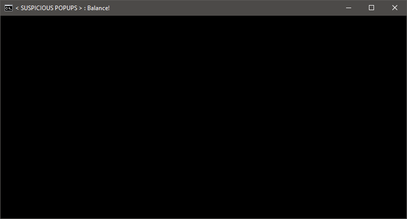
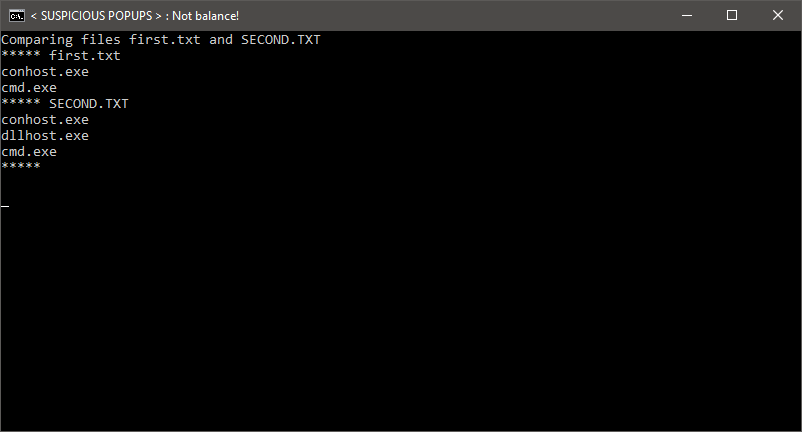
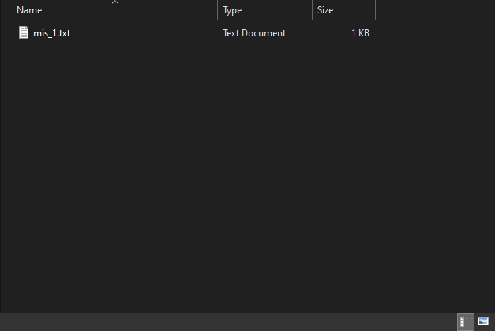

# Suspicious-Popups
This program detects suspicious popping application, But it can also detect other running apps so keep unnecessary apps close.

How to use?
________________________________________

> When you launch the launcher then you shouldn't run other application that might interrupt
the process and it can cause wrong mismatches.
> [Important]: Please if you create or put something important inside (mismatches) directory please remove it
or else when you execute the launcher it'll delete everything inside of it.
> You can close the launcher even if its running.
> Make sure before you check mismatch files inside (mismatches) directory, close the launcher so it won't
create wrong mismatch file.
________________________________________

If you have an issue regarding this program please e-mail
me at my gmail: techlord4lyfans@gmail.com
